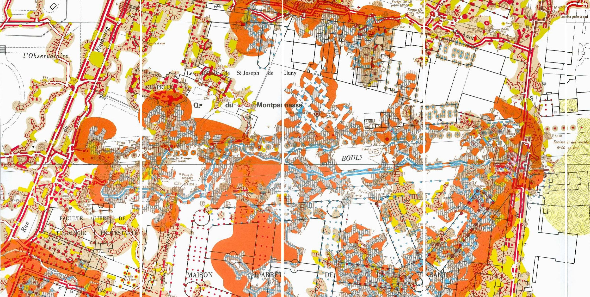

TL;DR: Building a map from scratch is fun

The Map _Sopal_ is a cartography of the underground tunnels of Paris, built as an interactive web-based map. It is available for a restricted number of people, since the information it contains is sensitive. In this Behind-the-scenes article, I will try to document my journey to build this map.

## Getting the data

The first thing needed to build a map is the data of the galleries, rooms, sightseeings and other curiosities. The galleries running under Paris are quite tortuous and even though they mostly follow the ground-level streets, they are not nearly as straight. Some parts are narrow, some are quite wide. Some parts are flooded with water, some are completely dry. Some parts are 3m high, while you need to crawl in some others. These are some of the details that I wanted to reflect on the map.

These galleries have been mapped in the XVIII, XIX and XX centuries, and even though some parts are outdated, it provides a really good ground to build from. This data is freely available from the town archives, and some people before me already scanned these paper maps and bundled them together, which made the process much easier.

*An exerpt of a paper-map.*

I needed the data to be vectorialized in order to store it in a database and render it for different zoom levels. OpenStreetMap's community created the excellent [JOSM](http://josm.openstreetmap.de/), an advanced cartography editor. This tool is mainly used to be coupled with OpenStreetMap's data but it is possible to tweak it in order to create your own cartography data. In the case of an underground network gallery, I had to create my own standard of tags and values to label my data, which ended up following OpenStreetMap's standards.

The process was very long. The network itself is _huge_, the total length of the galleries is around 130km of crooky paths. It took me almost 2 months of intense work to do a quick draft of the entire network, and have been working on making some parts more detailed (showcasing the wall types and gallery shapes, carvings and sculptures, paintings, and other furnitures) since then.

**>> Insert JOSM screencap <<**

The data I have at this point is OpenStreetMap-friendly (it uses the same format, even though tags and values are different for my purpose), which means that I could use pretty much any OSM rendering software

## Render the data: 1st prototype

The easiest way to render the cartographic data was to setup a Mapnik server to serve the tiles. In order to do that, I had to put all my data in a Postgres + PostGIS database, which was relatively easy to do using some tools like [`osm2pgsql`](https://github.com/openstreetmap/osm2pgsql/).

Once that was done, I had to design and define the styles for every object of the map. I wanted an underground feeling, a little bit mysterious but also fascinating, so I went for a dark map with hints of gold, like treasures scattered across the network. At the time, Mapbox was maintaining [Tilemill](https://tilemill-project.github.io/tilemill/), an open source map design studio and was extremely extensible to plug in custom map data like I have. Unfortunately, the project got discontinued and replaced by Mapbox Studio, a powerful editor which achieves the same job, but is also much more coupled with the Mapbox ecosystem, and harder to work with with custom data. Fortunately, around the same time, an open-source project named [Kosmtik](https://github.com/kosmtik/kosmtik) led by Johan Boniface was created, and managed to bring the powerful editing tools of Mapbox Studio and the extensibility of its predecessor together again. With that set up, I was finally able to design and get a first preview of how the map would look like.

## On the road to production

My needs for the production website were pretty simple: I wanted a tile-rendering server that was efficient (in terms of cost and speed) and easily pluggable with a custom backend, in order to make the tiles available to a selected number of people. I decided to go for a Node backend with a tile-renderer borrowed from the one in Kosmtik but tweaked to fit my restriction needs.

To fit my efficiency needs, I decided to use my personal server (which is really small - 10GB of disk space, 4 gig of memory, 1 CPU). Such a small server made rendering time go up to the roof, even for only 1 user. I implemented a naïve caching system which would cache on disk every single tile rendered. This approach worked because the map is focused on one area of the world - Paris, so the number of generated tiles for each zoom level is low enough to fit all the tiles on disk.

For the frontend, I initially went for a Jade (now Pug) + vanilla JS setup, and [Leaflet](http://leafletjs.com/) for the map, and then added some React-based components later on.

This map has been live for a year or so, and served to around 100 people.

## Building a better map.

One major issue I had with the setup was the use of tiles. It took a lot of disk space (because of the naïve caching), was slow to render, and doesn't feel modern. On devices with a high pixel-ratio (smartphones), the map would look pixelated. Also the "tile" feeling (where you can only see the map at certain zoom levels) was not something that I appreciated.

Vector tiles were already present and was a technology that I tried to investigate back when I was building the first prototype, but I was unable to set it up. This technology is not well documented at all, the biggest implementation belongs to Mapbox and they made it so that the easiest way to use it is to go through their paid APIs. The documentation on how to set it up for home-made solutions is not in place at all, and will probably never be.

But Mapbox has done great things, and all of them are open source. Which means that even though there is no documentation, the projects themselves are still accessible. While looking around for some information on Vector Tiles, I stumbled across a project named [tippecanoe](https://github.com/mapbox/tippecanoe). This project is exactly what I needed to build vector tiles: it can build `.mbtiles` files which can be downloaded and rendered on the client, using Mapbox-GL.js library.

This setup was amazing: the map is no longer rendered on the server, but on the client, which greatly leverages the server load, and enables the creation of vector maps, which are always 100% sharp. Some tweaks were necessary because the style specifications of a MapboxGL map are different than what Leaflet can do, so I had to convert everything from one format to the other, but the end result was fantastic. It also opens up offline possibility: because the map in itself is not so big (around 40Mb), it could be downloaded completely as a whole and cached with service-workers. This could give the opportunity to use the map from inside the tunnels (there is no internet network available 30m under Paris).